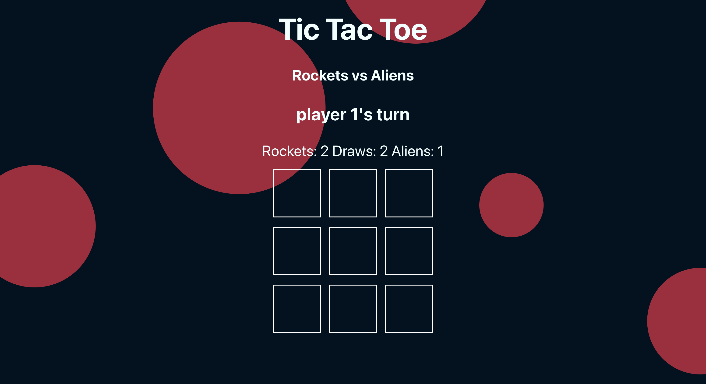
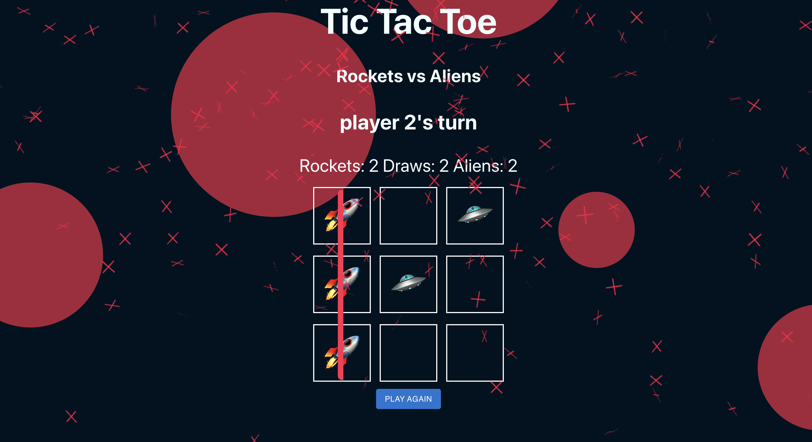
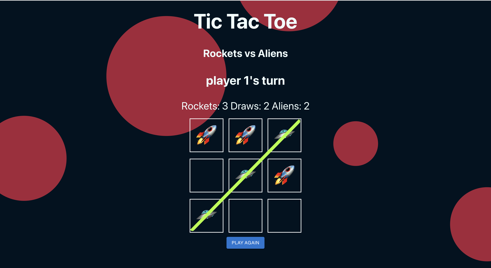

# Rocket vs Aliens Tic Tac Toe

> Live demo [Live Demo](https://zach7815.github.io/tictactoe/). <!-- If you have the project hosted somewhere, include the link here. -->

## Table of Contents

- [General Info](#general-information)
- [Technologies Used](#technologies-used)
- [Features](#features)
- [Screenshots](#screenshots)
- [Setup](#setup)
- [Project Status](#project-status)
- [Room for Improvement](#room-for-improvement)
- [Acknowledgements](#acknowledgements)
- [Contact](#contact)

## General Information

This was a Rocket Academy bootcamp project for front end only. It is my version of Tic Tac Toe.

It solves to allow a user to play rounds locally against someone else (or themselves), or the user can play against 3 levels of AI. easy, medium or Impossible. The easy level just chooses a empty cell at random. The intermediate will look to either block you or win the game but can still be beaten if the right strategy is chosen. The impossible level uses the minmax function to choose the AI's best possible move and thus make it impossible to win.

I choose to do Tic Tac Toe as I wanted to challenge myself to build a game. I wanted ot learn how to control the state of a game and ensure that flow of code was correct and make a good user experience from it. In addition, I wanted to learn algorithms such as minimax to be able to get better at coding concepts like recursion for future projects.

## Technologies Used

- React emotion - version 11.1.1
- React emotion styled -11.11.0
- Material typography - 14.0.0
- Mui core - 5.0.0-alpha.54
- Mui/material - 5.14.4
- Mui/styles - 5.14.4
- Jest - 5.17.0
- React - 18.2.0
- React-confetti - 6.1.0

## Features

- Victory confetti for user Win
- Difficulty options
- Local 2 player mode
- 3 AI modes - Easy - Random moves made - Intermediate - AI seeks to win and block user from winning (can be beaten) - Impossible - Uses minimax algorithmn can't be beaten
- Win/Draw/Loss tracker

## Screenshots

<!-- If you have screenshots you'd like to share, include them here. -->

## Setup

The app was created using Creat React App.

To run it:
clone the project
CD into the TicTacToe directory
run npm i
then npm run start

## Project Status

Project is: _No longer under development_

I am currently working on bigger and more complex full stack applications. 

## Room for Improvement

Include areas you believe need improvement / could be improved. Also add TODOs for future development.

Room for improvement:

- The code could do with some significant refactoring to make it cleaner and more maintainable.
- In implelementing the minimax I found many examples that used a 1 dimensional array where I had chosen a 2 dimensional matrix. This has meant the Impossible AI translates the gameboard from a matrix to a 1d array. In addition many examples used classes to make the gameboard and bind functions to it. This seems like a better approach to refactor the project to when I have time.
- The useEffects that run the different difficulties could be made into hooks as their almost identical apart from difficulty and AI function implemented.

To do:

- Refactor the Difficulties into one a reusable hook.
- Look to create and use a class to create the gameboard and state.
- Allow users to choose Alien or Rocket and then let the AI take the opposite role.

## Acknowledgements

- The minimax function was based and adapted from [FCC's coding tutorial](https://www.youtube.com/watch?v=P2TcQ3h0ipQ&t=1279s) without it I would still be banging my head against a wall in trying to get it too work.
- Many thanks to Rocket Academy for helping me with various bugs I faced while getting the project to work.

## Contact

Created by [Zach](https://zachkb.dev/) - feel free to contact me!
